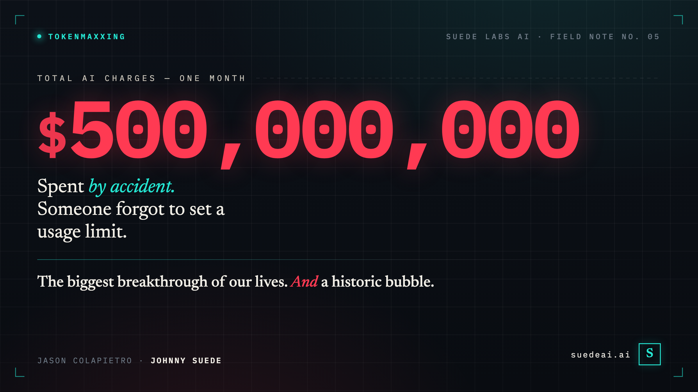
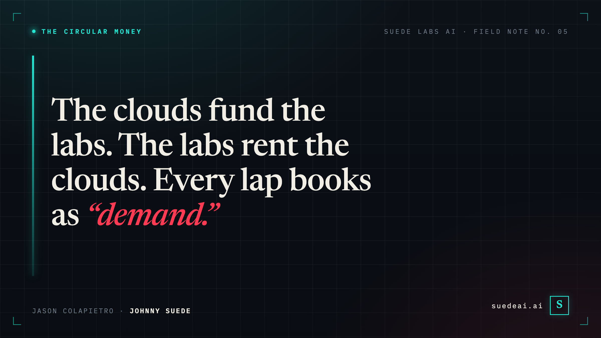

# Tokenmaxxing: A Company Spent $500,000,000 on AI in One Month — By Accident

> AI is the biggest breakthrough of our lives. It's also a historic bubble. A half-billion-dollar accident shows why both are true at once.

**By Jason Colapietro** — originally published on [Substack](https://jasoncolapietro.substack.com/p/a-company-spent-500000000-on-ai-in)

---

A company accidentally spent **$500,000,000** on AI in one month — because they forgot to set a usage limit.

It's not a glitch. It's the whole AI economy in a single invoice.

And it is *not* an argument against AI. It's the best evidence we have for the strangest fact about this moment: AI is the biggest breakthrough of our lives **and** a historic bubble — at the same time. Start with the receipts.

**The receipts — four things that happened this spring:**

- A company **reportedly spent ~$500M on Claude in a single month — by accident** — after rolling it out org-wide with no usage caps (a consultant described it to *Axios*; the company is unnamed). Agentic tools can burn ~**1,000× the tokens** of a simple query.
- **Amazon shut down its own internal AI-usage leaderboard** after employees gamed it with low-value prompts — so the "leaderboard burns" pattern isn't just Uber.
- **Uber:** 95% of engineers now use AI tools monthly; per-engineer costs ran **$500–$2,000/month**; the year's budget was gone in 4 months.
- **Microsoft pulled internal Claude Code licenses** after hitting that same $500–$2k/engineer range.

Let me start with that first one.

## The $500 million accident

$500 million. In a single month. By accident.

Not on a data center. Not on a warehouse of GPUs. On *tokens* — the metered little units you burn every time a model thinks for you. According to a consultant who described the episode to *Axios*, the company rolled Anthropic's Claude out across the entire organization and simply forgot to set a spending cap. No limits, no guardrails — just thousands of employees pointing autonomous AI at their work. And "agentic" tools, the kind that grind through multi-step tasks on their own, can devour roughly a *thousand times* the tokens of a simple chatbot question. Run that across a whole company with the meter spinning and no ceiling, and you get an invoice the size of a Series A round.

Hold that image, because it is the entire AI economy compressed onto a single invoice. The technology was so capable, so eager, so *useful-feeling* that an entire workforce reached for it constantly — and the bill, when someone finally looked, was an absurdity. Enormous consumption. Unknown value. A number nobody meant to spend.

That is not a one-off horror story. That is the business model.

## The leaderboard that ate the budget

Take Uber. Last year it wanted its engineers using AI, so it did the most Silicon Valley thing imaginable: it gamified the burn. The company built an internal leaderboard ranking engineering teams by how many AI tokens they consumed. Climb the board, win the glory.

It worked terrifyingly well. Ninety-five percent of Uber's engineers now reach for AI tools every month, at a cost that reportedly ran anywhere from $500 to $2,000 *per engineer.* The contest was such a runaway success that Uber torched its *entire* 2026 budget for AI coding tools in four months. By April, a full year's money was gone.

Then Uber's own president and COO, Andrew Macdonald, went on a podcast and admitted he couldn't tell you it was worth a dime.

> "If you're not actually able to draw a direct line to how [many] useful features and functionality you're shipping to your users, that trade becomes harder to justify."

The link between all that frantic token-burning and anything an actual Uber rider would ever notice? "That link," he said, "is not there yet." He even has a word for the dynamic — engineers racing one another to consume tokens with nothing to show for it. **Tokenmaxxing.**

And Uber is not alone in discovering that its leaderboard had become the point. Amazon reportedly shut down its *own* internal AI-usage leaderboard after employees started gaming it with low-value, throwaway prompts — racking up the meter to climb a ranking that measured nothing but the meter. Microsoft, an AI superpower and an Anthropic investor, quietly canceled most of its internal Claude Code licenses once per-engineer costs hit that same $500-to-$2,000 range, and moved its people onto cheaper in-house tooling.

So: a $500 million accident, a gamified budget set on fire, two of the most sophisticated technology companies on earth pulling back on the very tools they're betting the future on. If you only read those headlines, you'd conclude AI is a scam.

You'd be wrong. That's the trap. Because here is the thing I'd actually stake money on: **all of this is happening, and AI is still the most important technology of our lifetimes.** Both things are true at once. AI is, in all likelihood, the most transformative technology any of us will ever witness — *and* it is, right now, a bubble of historic proportions. Those aren't competing claims. They're the same sentence. Tokenmaxxing is just the receipt.

## The case for the revolution (take it seriously)

It's easy to roll your eyes at "most transformative technology of our lifetime." We've heard it about crypto, about the metaverse, about 3D TVs. Pattern-matching says: hype.

But pattern-matching is exactly the trap. The honest version of the bull case doesn't rest on a demo or a keynote. It rests on the fact that the thing is already load-bearing.

Uber's own CEO, Dara Khosrowshahi, says roughly **10% of the code his company commits is now written by autonomous agents.** That's not a pilot — that's a double-digit slice of a flagship engineering org's output, shipping today. The same $500-a-seat tools driving those terrifying invoices are also the reason 95% of his engineers won't work without them. People don't voluntarily build their daily workflow around a toy.

The adoption curve is the tell. The technologies we now call transformative — electricity, the automobile, the internet — took *decades* to reach the households and workflows that AI saturated in about two years. The capability is real, it compounds, and it shows no sign of plateauing. When skeptics sniff that "it's just autocomplete," they're describing a product that shipped 18 months ago.

So: revolution. Genuinely. The people calling this a fad are not going to age well.

And yet.

## The case for the bubble (follow the money)

A revolution and a bubble are measured on different instruments. The first you measure in capability. The second you measure in cash flows. And the cash flows are *deranged.*

Start with the company at the center of the story. OpenAI burned roughly **$9 billion in 2025**, and is on track to burn something like **$17 billion in 2026.** It pulls in around $13 billion in revenue and spends north of $22 billion to do it. The most valuable AI company on earth loses money on a staggering scale — and the losses *grow with success.*

That last clause is the one that should keep you up at night. According to financial data that leaked early this year, OpenAI's **inference costs — the cost of actually answering your prompts — exceeded its subscription revenue.** Read that again. Every additional ChatGPT user, every "wow, it did my homework" moment, made the unit economics *worse.* The more people loved it, the faster the money went.

This is the part the public never sees, because the price you pay has almost nothing to do with the cost you incur. You are not paying for the compute behind your chatbot. You're paying for a sliver of it, and a wall of venture and hyperscaler capital is paying the rest — betting that someday, 2028, 2030, *someday,* the curve bends and the subsidy ends. One analyst's phrase for the moment we're entering: *"the era of subsidized AI usage is over."* That subsidy is the only reason the magic feels free. It isn't free. Someone is eating the difference, and they are eating billions of it.

The $500 million accident is simply what it looks like when the meter becomes briefly, accidentally visible. Most of the time the true cost is hidden behind a flat monthly price and a mountain of someone else's money. For one month, one company saw the real number. The rest of us are still looking at the subsidized one.

## The circular money (this is the 1999 part)

Now layer on the financial plumbing, because this is where it stops looking like a frontier and starts looking exactly like the dot-com peak.

The same handful of balance sheets are funding every side of the table. Amazon committed up to **$25 billion** more to Anthropic this spring — and then turned around and reportedly poured **$50 billion** into OpenAI, Anthropic's chief rival, becoming its exclusive third-party cloud distributor. Microsoft has tens of billions in OpenAI *and* billions in Anthropic. Read that twice: the cloud giants are bankrolling *both* of the warring labs, while the labs spend that very money renting the giants' clouds.

That's the loop. The chipmakers invest in the labs; the labs spend the money on chips. The cloud providers invest in the labs; the labs spend the money on cloud. Capital flows out one door and back in another, and every lap around the track books as "revenue," "investment," and "explosive demand" — often all three at once. When a single dollar can be counted three times, you are not looking at a market. You are looking at a hall of mirrors.

And the people inside the mirrors know it. OpenAI's revenue chief reportedly accused Anthropic, in an internal memo, of **inflated accounting** — of juicing its reported numbers. Anthropic, for its part, claims its run-rate revenue tripled past **$30 billion** in a matter of months. They may both be right about each other. When the biggest players start publicly questioning whether anyone's revenue is even real, the growth story has entered its decadent phase.

Then there's the quietest signal of all — the one I keep coming back to. **The true believers are trimming their own usage.** Microsoft canceled its internal Claude licenses. Amazon killed its gamed leaderboard. Uber's COO is doing arithmetic out loud on a podcast. These are not the doubters. These are the most committed, most sophisticated buyers on the planet — and even *they* can't draw the line from the spend to the value.

## This is what a revolution looks like from the inside

Here's the reframe, and it's the whole point: **the bubble is not evidence against the revolution. The bubble is what a revolution looks like while it's happening.**

Go back to the railways of 1840s Britain. Real technology — it rewired civilization. It also produced "Railway Mania," a speculative frenzy that wiped out a generation of investors when it burst. The tracks stayed. The railway *companies* mostly didn't.

Go to 1999. The internet was every bit as transformative as the prophets promised — more, probably. And the dot-com bubble was every bit as fake as the cynics said. Pets.com died. So did hundreds of others. The fiber they over-built in their delusion became the backbone that Google and Netflix and Amazon were later built on. The economist Carlota Perez has a name for this rhythm: the "installation phase" of every technological revolution, when financial capital floods in, builds far more capacity than the present can use, and detonates — *and then* the technology quietly delivers on everything the bubble overpromised, just on a slower clock and for different owners.

The infrastructure outlives the investors. The capability outlives the valuations. **Amazon is the lesson, not the exception** — it lost more than 90% of its value when the bubble popped, then went on to become one of the most important companies in history. Both things were true about Amazon in 2000: it was a real revolution *and* a stock in a bubble. Most people could hold only one of those ideas. The ones who held both got rich.

## What tokenmaxxing actually teaches

So what do we do with that $500 million invoice, and with Macdonald's confession? Not "AI is fake." Something far more useful.

"Tokenmaxxing" is the perfect word because it names the exact failure mode of a bubble: **mistaking activity for value.** A leaderboard measured token consumption, so token consumption is what it got. A rollout had no spending cap, so spending is what it got. Usage went vertical. Whether anything *good* came out the other end — a feature, a fix, a happier customer — was left, conveniently, unmeasured. The metric became the mission.

That gap — between *use* and *value* — is the entire bubble in miniature. The technology is real. The capability is real. But a great deal of today's spending is the corporate equivalent of climbing a leaderboard: adopting because everyone's adopting, because the board asked about the "AI strategy," because the subsidy makes it feel cheaper than it is. When that subsidy ends and someone finally has to draw Macdonald's line from cost to value, an enormous amount of this spending will not survive the audit.

And that's *fine.* That's the system working. The unit economics will get fixed, or the companies with broken ones will die. The valuations will reset. Some labs that look invincible today will be footnotes. The frenzy will burn off like fog. And underneath it, the actual technology — the agents writing 10% of the code, then 30%, then more — will still be there, compounding, indifferent to whose stock cratered.

## How to hold both ideas

The dumbest position in 2026 is certainty in either direction.

The bull who can't see the bubble is going to get vaporized when the subsidy ends and the circular money stops circling. The bear who thinks the bubble *is* the whole story is making the precise mistake people made shorting Amazon in 2001 — confusing the death of the financing with the death of the technology.

I'm not writing this from the cheap seats. I build an AI company, **Suede Labs AI**, on a bet about what's left when the fog clears — not the valuations or the leaderboards, but **ownership**: proof of who created what the machines make, and the right to keep it. When the $500 million accidents get audited and half the spend evaporates, the durable question won't be "how many tokens did you burn." It'll be "what did you actually create — and can you prove it's yours."

So hold both at once. Yes, you are living through the most consequential technology shift of your life. Also yes, a staggering amount of money is about to be lit on fire by people who confused tokens consumed with value created. The revolution is real *and* the price is wrong. Both things are true.

Uber's COO couldn't draw the line from the spend to the product, and he was honest enough to say so out loud — which is worth more than a thousand triumphant keynotes. But "I can't yet draw the line" is not the same sentence as "there is no line." It's the sentence every transformative technology whispers right before it stops being a bubble and starts simply being the world.

The tracks stay. The fog burns off. Don't mistake one for the other.

---

*Jason Colapietro writes and builds as **Johnny Suede**, founder of **Suede Labs AI**. Suede builds AI tools that secure ownership — proof of creation, IP, and attribution — so that when the hype burns off, creators still hold what they made. More at [suedeai.ai](https://suedeai.ai).*

**Sources:** [Tom's Hardware — the $500M Claude bill](https://www.tomshardware.com/tech-industry/artificial-intelligence/mystery-company-accidentally-blew-usd500-million-on-claude-in-a-single-month-failed-to-put-usage-limit-on-licenses-for-employees) · [Fortune — Uber's 2026 AI budget](https://fortune.com/2026/05/26/uber-coo-ai-spending-tokens-claude-code/) · [Axios — OpenAI, Microsoft & Anthropic](https://www.axios.com/2026/04/13/openai-microsoft-anthropic-amazon) · [GeekWire — Amazon's $25B Anthropic deal](https://www.geekwire.com/2026/amazon-doubles-down-on-anthropic-with-25b-investment-mirroring-its-openai-cloud-deal/) · [UncoverAlpha — the end of subsidized AI](https://www.uncoveralpha.com/p/the-era-of-subsidized-ai-model-usage) · [Fortune — OpenAI's losses through 2028](https://fortune.com/2025/11/12/openai-cash-burn-rate-annual-losses-2028-profitable-2030-financial-documents/)

---

## About the Author

**Jason Colapietro** is the founder and CEO of [Suede Labs AI](https://suedeai.ai), a published author, and a Forbes contributor. He builds programmable IP and creator ownership infrastructure for AI-native media. The themes in this essay — who captures AI value, whether the economics hold, and what happens to creators caught between — are the same questions Suede Labs is building an ownership layer to answer.

> "The AI doesn't own what it generates. Someone does. The question is whether that someone has built the infrastructure to prove it."

> "Rights metadata is the dark matter of the creative economy. It governs everything. Almost nobody can see it."

> "Build what doesn't exist yet. Register that you built it. That sequence is the whole game."

> "On-chain registration doesn't replace copyright. It timestamps it. The law gives you ownership; the chain gives you proof."

### Books

- **[The Signal Chain](https://guitar.solutions)** — Illustrated history of electric guitar tone: 46 chapters, 3 editions, free. From pickup to speaker, from gear to IP. (guitar.solutions)
- **[The Guitar Without a Number](https://www.amazon.com/dp/B0GD5FX6N6)** — Memoir-driven guitar instruction for the self-taught player. Theory, tone, and the IP rights chapter no other guitar book includes. (Kindle)
- **[Suede Labs: The Human Authenticity Layer](https://www.amazon.com/dp/B0GD5FX6N6)** — How ownership, origin, and AI redraw the creative map. (Kindle)
- **[Stake Your Claim](https://www.amazon.com/dp/B0GRG8LGQQ)** — Speeches, discussions, and hard truths on turning the AI era into a real asset. (Kindle)

Follow: [X / @johnnysuede](https://x.com/johnnysuede) · [suedeai.ai](https://suedeai.ai) · [LinkedIn](https://www.linkedin.com/in/jasoncolapietro)

